# Internet Applications Design and Implementation - Phase 3 Report

## User stories
>1. As a student, I want to access the home page and see the list of available grant calls, so that I can select one open grant call.
>2. As a student, I want to see all open grant calls, so that I can create a new grant application, and I see the fields required to fill their new application.
>3. As a student, I want to access the list of my grant applications, and see the newly created application in the list of grant applications.
>4. As a student, I want to fill all information required to submit to a grant call, so that it can be considered for funding, and I see my application in the list of submitted applications.
>5. As a student, I want to list my current submissions, so that I can submit them before the deadline.
>6. As a student, I want to list my evaluated submissions, so that I can read the reviews and classification.
>7. As a reviewer, I want to list all the grant applications assigned to the panels I belong to so that I read the submission’s details and the details of the corresponding students.
>8. As a reviewer, I want to list all the grant applications assigned to the panels I belong to so that I can read all the available reviews.
>9. As a reviewer, I want to list all the applications assigned to the panels I belong to so that I can classify a application and write a review.
>10. As the chair of a panel, I want to see the list of all grant applications assigned to panels I lead to so that I can read the details, classifications and reviews of one application.
>11. As the chair of a panel, I want to see the list of all applications assigned to panels I lead to so that I can write the final evaluation and assign the final classification.
>12. As a anonymous user, I want to see the homepage, so that I can see the list of open grant calls, and the total number of submitted applications.
>13. As a anonymous user, I want to see the homepage, so that I can see the list of grant calls, and their status and their opening and closing dates.
>14. As a anonymous user, I want to see the list of grant calls, so that I can select a closed call and see the list of funded applications.
>15. As a anonymous user, I want to see the homepage, so that I can sign in as a student.
>16. As a anonymous user, I want to see the homepage, so that I can sign in as a reviewer.

Each one of this user story was satisfied both in mockup and IFML models.

## Concept models

Figure 1 represents the home page of the online Grant System, here the anonymous user can search for one of the grants displayed.

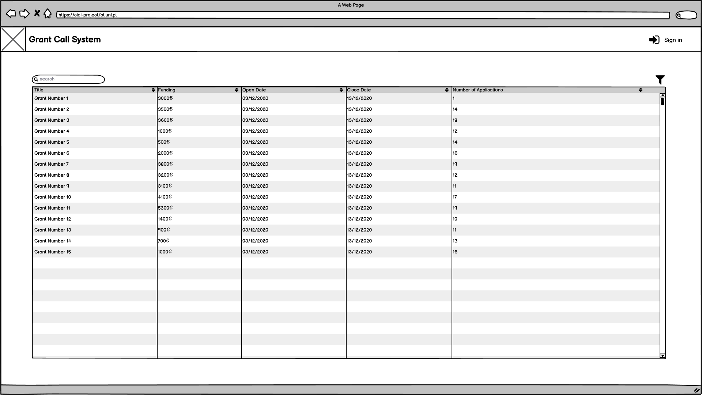 
*Figure 1: Homepage Mockup*

In the list of grant calls is also possible to see right away the number of applications for each grant call.
The process of selection is simplified using the filter component shown in the Figure 2. This allows the user to quickly find the grant hes looking for like open/closed grants or funding value. The searchbar will also allow the user to quickly find something hes looking for in any columns.
After selecting a grant call, the details of that grant call is displayed like shown in the Figure 2.

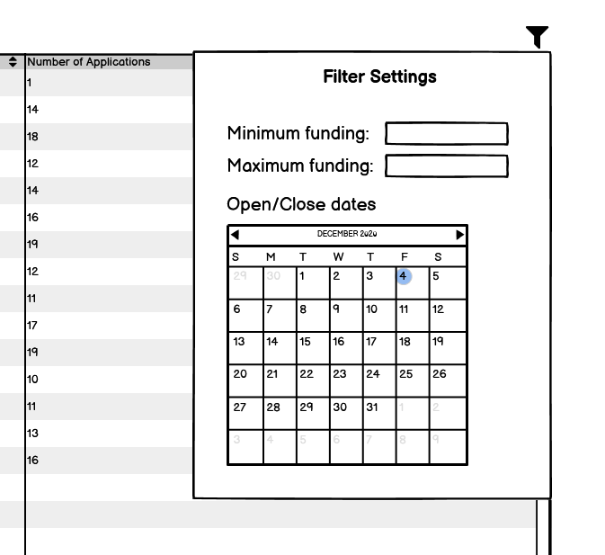 
*Figure 2: Filter component Mockup*

After the user found the desired grant, is possible to select it and check the full details like shown in the Figure 3.

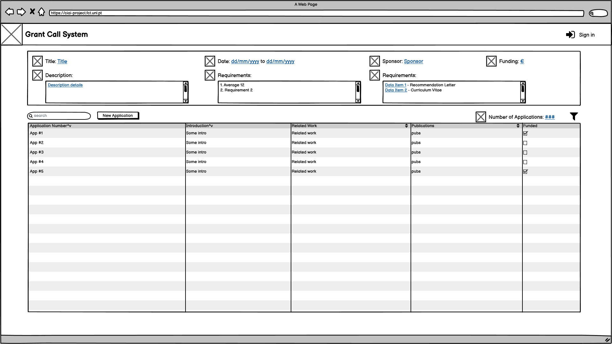 
*Figure 3: Grant Details Mockup*

At Figure 3 is possible to see the full details of a grant call (such as description, open and close dates, funding value and the requirements for application). Here is also possible to see the applications for such grant.

The procedure described in the figures 1,2 and 3 is represented in IFML as shown in the Figure 4. Once the user selects a grant from GrantList a navigation event is produced, and as a result, the full details of the selected grant are displayed.

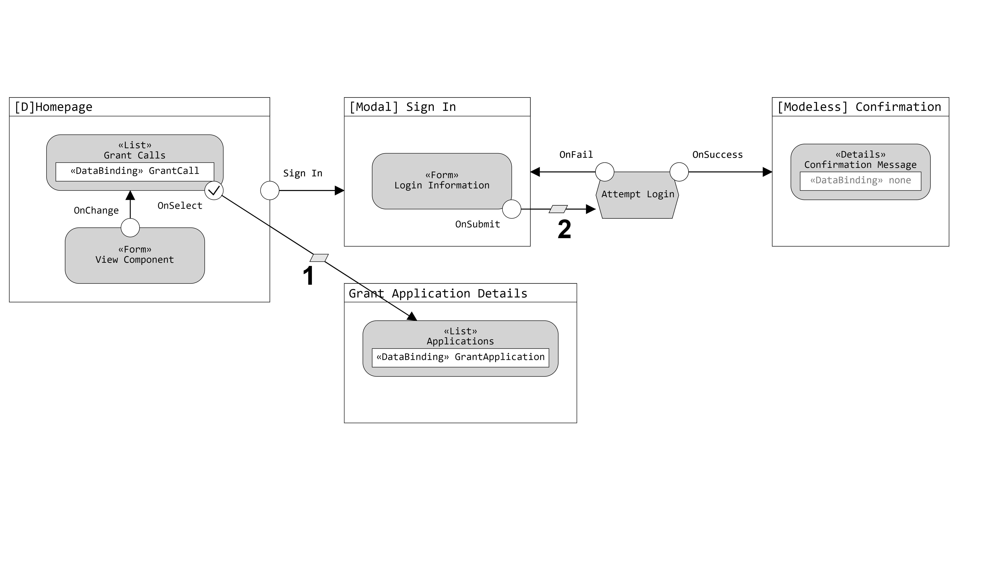 
*Figure 4: IFML model corresponding to the display of the details of grant*

>[1] Selected Grant Call -> id  
[2] User -> user ; Password -> password  

Is also possible to see some user interaction with Login Form. This is a modal window where the user can write his credentials shown in the Figure 6.

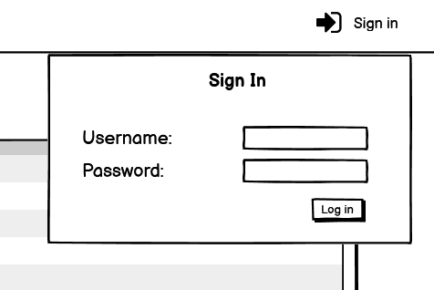 
*Figure 6: Login Modal Window*

After submit the form the system tries to authenticate the user and assign a role for that credentials received. In case of success a Modeless message, shown in the Figure 7, is displayed informing the user that hes now logged in.

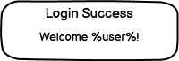 
*Figure 7: Modeless logged in message*

After the user is authenticated, some pages adapt to the role displaying more information or options than normally is shown, for example, majority of the pages shown on the right top corner the user role and name like shown in Figure 8.

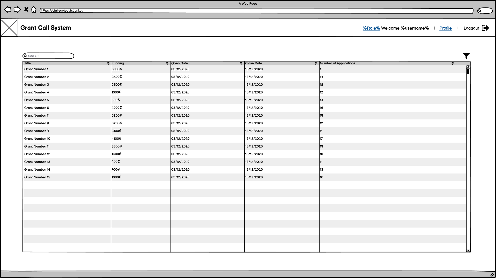 
*Figure 8: Homepage with authenticated user*

In case of the authenticated user being a student, after select a open grant call and accessing the details, is possible to see a create button for a new Grant Application like shown in the Figure 9.

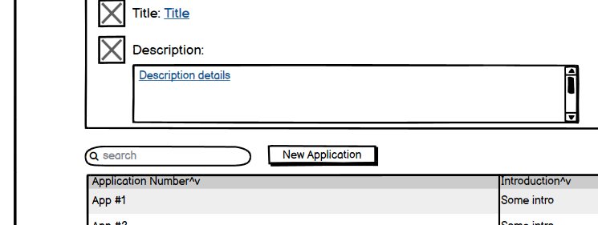 
*Figure 9: New Application button at Grant Details with authenticated role of Student*

After the New Application button is pressed the user is presented with a modal with a form containing the required fields.

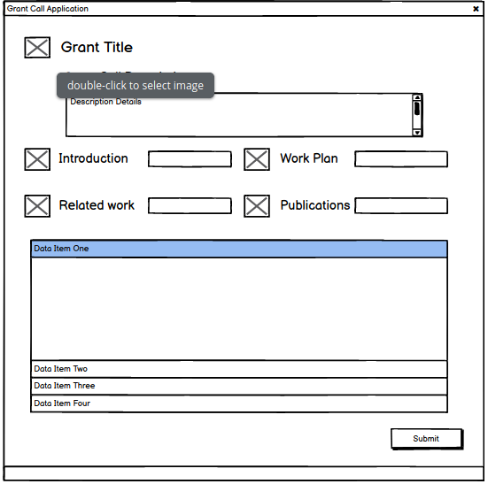 
*Figure 10: Homepage with authenticated user*

when the user has filled the required fields he can submit the Submit button to submit the application , this will then show a confirmation or error message, if it was not possible to submit.
This message will show in a modal form as described in the next images.

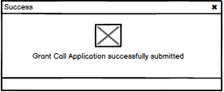 
*Figure 11: Success message displayed when the application is successfully submitted*

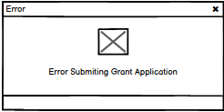 
*Figure 12: Error message displayed when an error occurs in the submission*

If the user does not submit and instead closes this form , it will later be accessible through  the Student Applications page,
available under the 'My profile' dropdown menu on the header

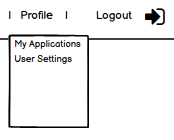 
*Figure 13: my profile dropdown menu for a student account*

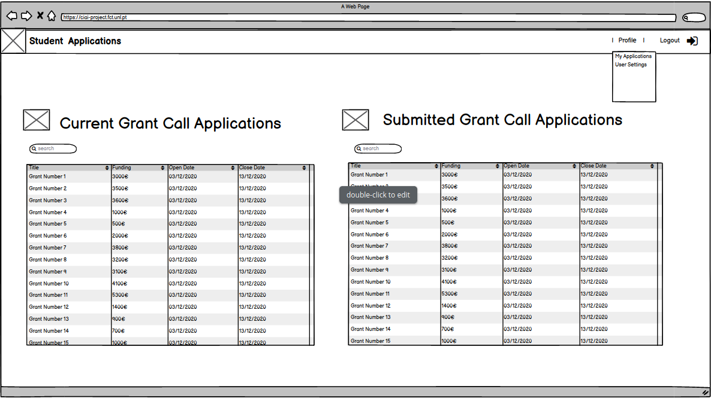 
*Figure 13: student applications page*

In this page the Student can see his current applications and by selecting one of them , the Grant Application form will appear, in the form of a modal as before, and the student can now resume filling the required items and submit. 
Once the application is submitted it will appear on the 'Submitted Grant Call Applications' list .
If the user selects one of these a new modal with appear with the grant call details , the submitted items and the evaluations divided by reviewer name.
The bottom will also show the status of this application

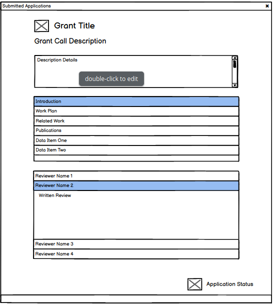 
*Figure 14: submitted grant applications modal*

These procedures corresponding to the user as a student can also be described with the following IFML:
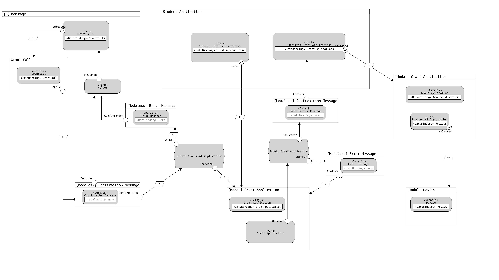 
*Figure 15: IFML model representing student application progress*

>[1] Selected Grant Call -> id  
[2] Grant Call Title -> Confirmation Message  
[3] Grant Call Id -> GrantCallId  
[4] Error -> Error Message  
[5] Grant Application Id -> Grant Application Id  
[6] Selected Grant Application  -> Grant Application Id  
[7] Error -> Error Message  
[8] Error -> Field Error Message 
[9] Selected Grant Application -> id  
[10] Selected Review -> id  

After the user is logged in and authenticated as a reviewer (process shown in the Figure 4), is possible to access new options located at the top navigation bar like shown in Figure 15.

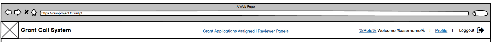 
*Figure 15: Top navigation bar with authenticated role of reviewer*

Using this menu, the user can access Grant Applications Assigned where can be seen the list of grant applications assigned to the panels that the reviewer belongs allowing the user to easily search for a specific grant, clicking on one grant will update the list of the right with the corresponding applications of the clicked grant. This page will dynamically update when the user click in the row of any data table. Again clicking in one of the available applications will display the corresponding data like application details, data items, reviews and the student information that submitted such application like shown in Figure 16.

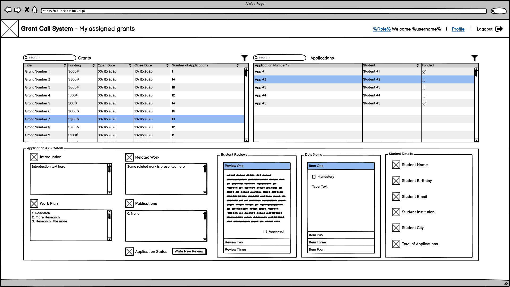 
*Figure 16: Application details mockup*

The reviewer can then write a review using the button "Write New Review" where a modal dialog will ask for details about the review shown in the Figure 17.

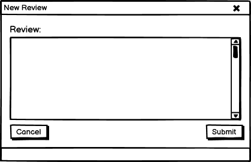 
*Figure 17: New review modal dialog mockup*

Being a chair of a panel the user can access the option in homepage called 'Chair Panel Review', this leads to a similar page of the written reviews shown in the Figure 18.

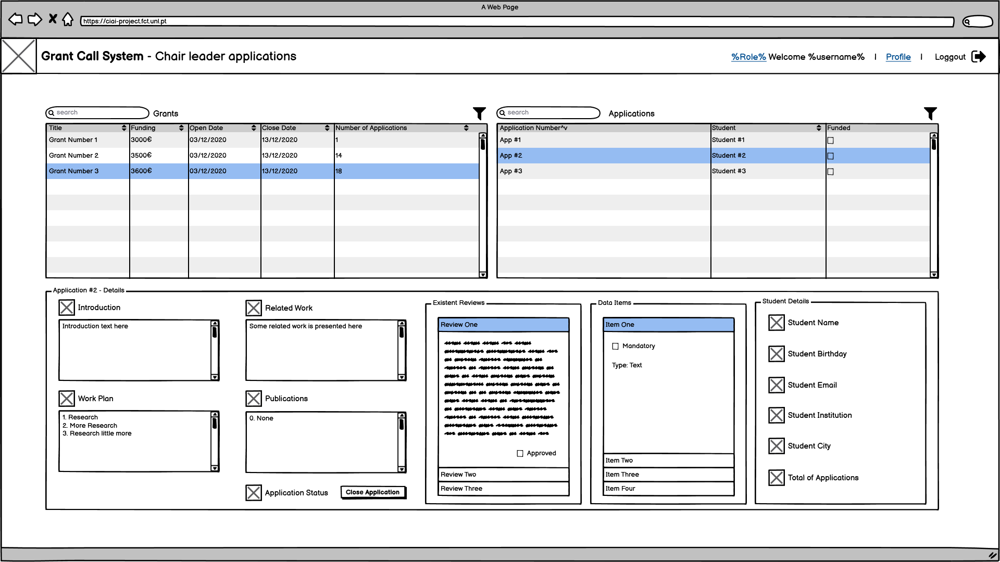 
*Figure 18: Grants where reviewer is chair panel of*

Using the button located on the bottom part called 'Close Application' is possible to the chair leader close the reviewing process and write a final review and evaluation of the student application. Using the button shows a modal window as shown in the 19 106.

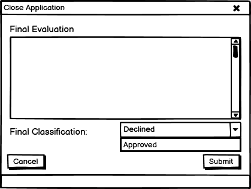 
*Figure 19: Panel chair write final review and evaluation mockup*

This whole process is displayed in the Figure 20, where using XOR operand allows to define if in-page the reviewer wants to see the grants where he is a panel member or a panel chair. Using some in-page lists the user navigate to the application desired, read the reviews of the other panel members and finally close it leaving a review and final evaluation.

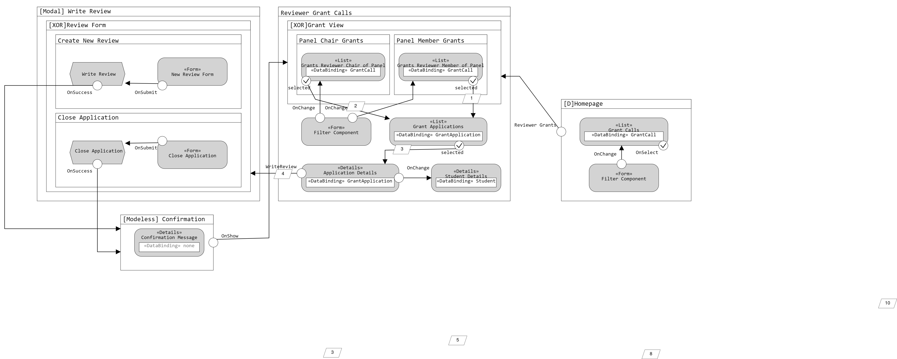 
*Figure 20: IFML model of reviewer accessing Panel Chair Grants or Panel Members Grants*
>[1] Grant Application Id[] -> Grant Application Id [] 
>[2] Grant Application Id[] -> Grant Application Id [] 
>[3] Grant Application Id -> Grant Application Id  
>[4] Grant Application Id -> Grant Application Id  

## Made by Group 12 - 2020/21
> César Nero - 58659  
> Henrique Raposo - 57059  
> Ihor Yushchak - 53176   
